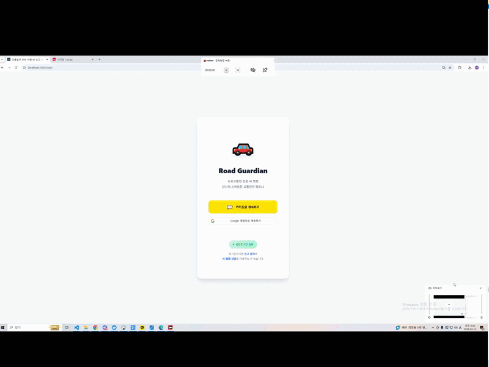

  <h1 style="margin-top: 20px; margin-bottom: 10px;">Minwoo Park</h1>
  
  
<b>AI Engineer</b>

  

    
    &nbsp;
    
  

 

---

### 🛠️ Technical Skills

**AI & Vision** 
     

 

**Backend & Infrastructure** 
     

 

**Collaboration** 
 

 

---

###  Featured Projects

<h3 style="border-bottom: 2px solid #eee; padding-bottom: 10px;">🚘 AI Traffic Violation Detection System</h3>

<i>Role: Project Manager (PM) & AI Engineer | Team of 5</i>

> 교통법규 위반(신호위반, 중앙선 침범 등) 차량을 실시간으로 탐지하고, 위반 증거 영상을 생성하여 안전신문고에 자동 신고하는 무인 단속 시스템

**1. Edge-Server Distributed Architecture**  
   
<ul>
  <li><b>Edge (Raspberry Pi):</b> 영상 촬영 및 녹화 영상 AWS 클라우드 전송 및 관리</li>
  <li><b>Server (PC):</b> <b>FastAPI</b>를 활용한 AI 추론 서버 구축 및 <b>Spring Boot</b> 기반의 비즈니스 로직(신고 데이터 처리) 연동</li>
  <li><b>Stability:</b> <b>Docker</b> 컨테이너 기반의 가상 환경을 구축하여 하드웨어 의존성 문제 해결</li>
</ul>

**2. AI Vision Pipeline**  
  
<ul>
  <li><b>Detection:</b> AI-Hub 대용량 위반 차량 이미지 데이터(300GB)를 학습한 모델로 위반 종류(신호위반, 중앙선 침범 등) 분류</li>
  <li><b>Segmentation:</b> <b>Detectron2</b> 및 투영 변환(Perspective Transform) 기술을 적용하여 차량 객체 및 도로 시설물 정밀 탐지</li>
</ul>

**3. Web Interface & Management**  
 
<ul>
  <li><b>Frontend:</b> <b>React</b> 기반의 실시간 관제 모니터링 대시보드 및 신고 내역 관리 페이지 구현</li>
  <li><b>Collaboration:</b> <b>Jira</b> 애자일 스프린트 도입으로 개발 일정 관리 및 이슈 트래킹</li>
</ul>

**4. Additional Materials** 

  
  

  

 

<h3 style="border-bottom: 2px solid #eee; padding-bottom: 10px;"> AI-based VGA Price Prediction</h3>

<i>Role: Solo Developer (Full-Stack)</i>

> 그래픽카드 시세 데이터를 수집 및 분석하여, 향후 가격 변동을 예측하고 최적의 구매 시기를 제안하는 시계열 분석 솔루션

**1. Data Engineering & Modeling**  
  
<ul>
  <li><b>Data Collection:</b> <b>Selenium</b> 및 Pandas를 활용하여 다나와(Danawa) 3년 치 시세 데이터 크롤링 및 전처리</li>
  <li><b>Deep Learning:</b> <b>LSTM</b> 및 <b>CNN-LSTM</b> 아키텍처 비교 실험을 통해 시세 변동 패턴에 최적화된 모델 선정</li>
</ul>

**2. Visualization & Service**  
 
<ul>
  <li><b>Dashboard:</b> <b>Streamlit</b>을 활용하여 사용자 친화적인 대시보드 구축</li>
  <li><b>Analysis:</b> 모델별 예측 결과 그래프 비교 및 성능 지표(RMSE) 시각화 제공</li>
</ul>

  

  

 

---

###  Experience

<b>Koh Young Technology (고영테크놀러지)</b>   
<i>Field Service Engineer | 2023.02 ~ 2024.06</i>
<ul>
  <li>SPI/AOI 정밀 3D 검사 장비 셋업 및 제조 환경별 S/W 파라미터 최적화</li>
  <li>고객사 기술 이슈 트러블슈팅 및 본사 개발팀(Vision/SW) 협업을 통한 배포 검증</li>
  <li>스마트팩토리 구축을 위한 장비-서버 간 통신 프로토콜 분석 및 데이터 연동 지원</li>
</ul>

 
